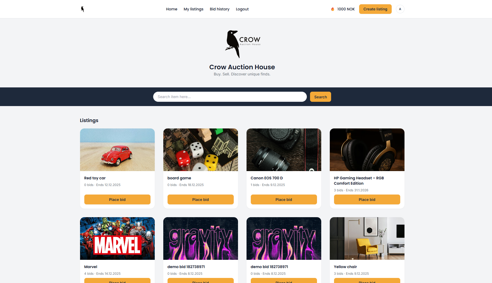
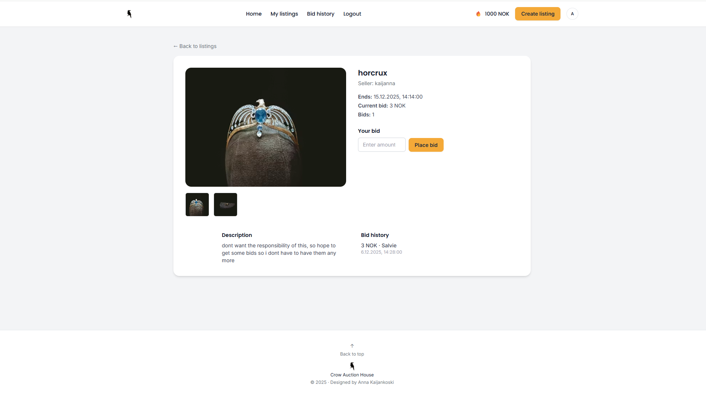
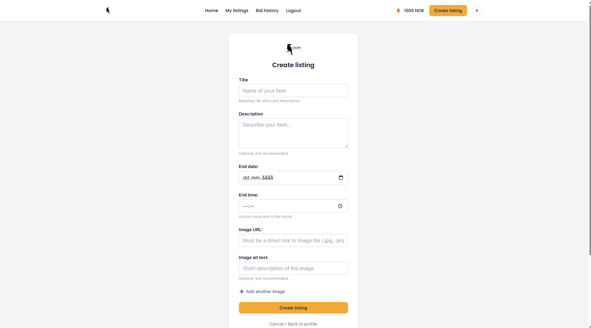
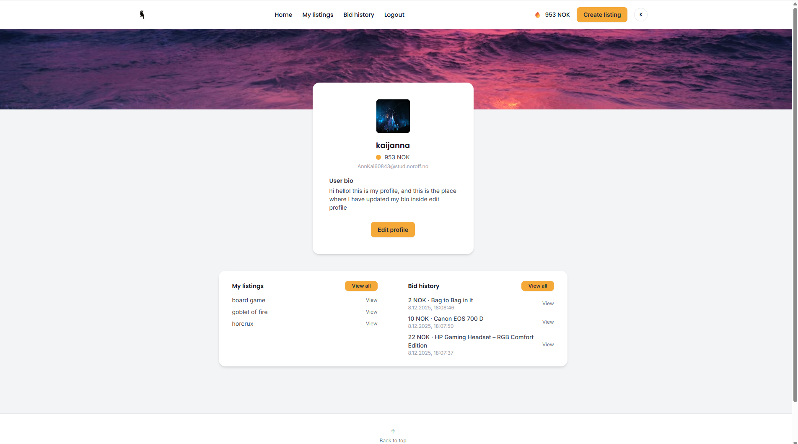
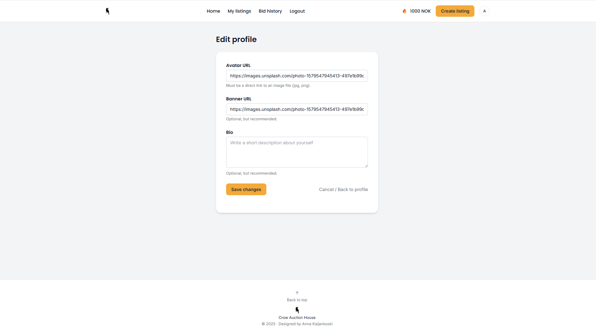

# Crow Auction House

An auction website where users can register, log in, browse listings, place bids, and create their own auctions.  
This project is made for **Semester Project 2** at Noroff (Frontend Development).

---

## Features

### User

- Register new account
- Log in / log out
- View profile
- Edit profile (bio, avatar, banner)
- See own credits

### Listings

- Browse all listings
- Search for listings
- View single listing
- Place bids
- Create listing
- Edit listing
- Delete listing
- View “My listings”
- View “My bids”

---

## Tech Stack

- **HTML5**
- **Tailwind CSS**
- **Vanilla JavaScript**
- **Noroff Auction API v2**

---

## How to Run the Project

1. Clone or download the repo
2. Install dependencies

```bash
npm install
```

3. Run development server

```bash
npm run dev
```

4. Open the project in your browser

```bash
http://localhost:5173
```

## Screenshots

### Home Page



### Single Listing



### Create Listing



### Profile Page



### Edit Profile



---

## Author

Anna – Frontend Development student at Noroff
