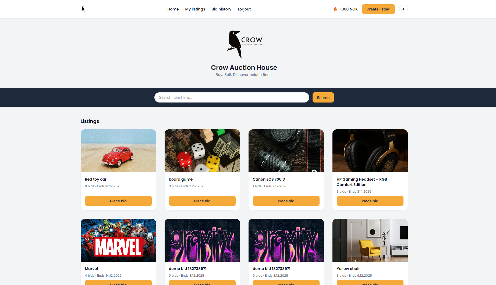
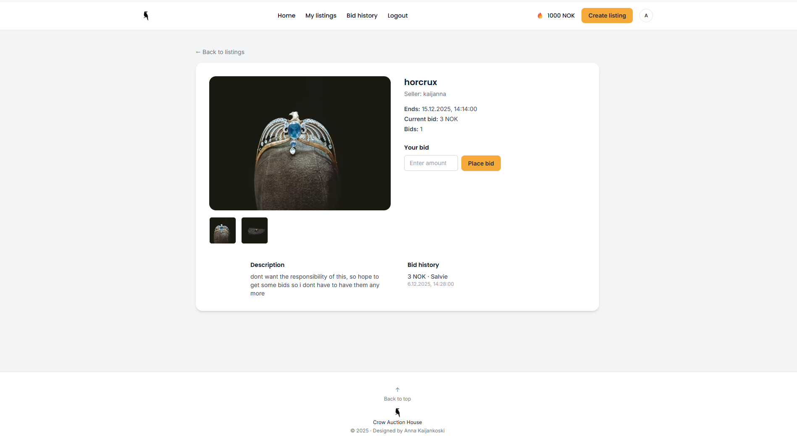
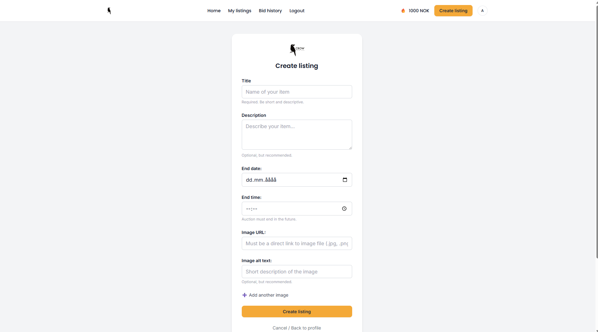
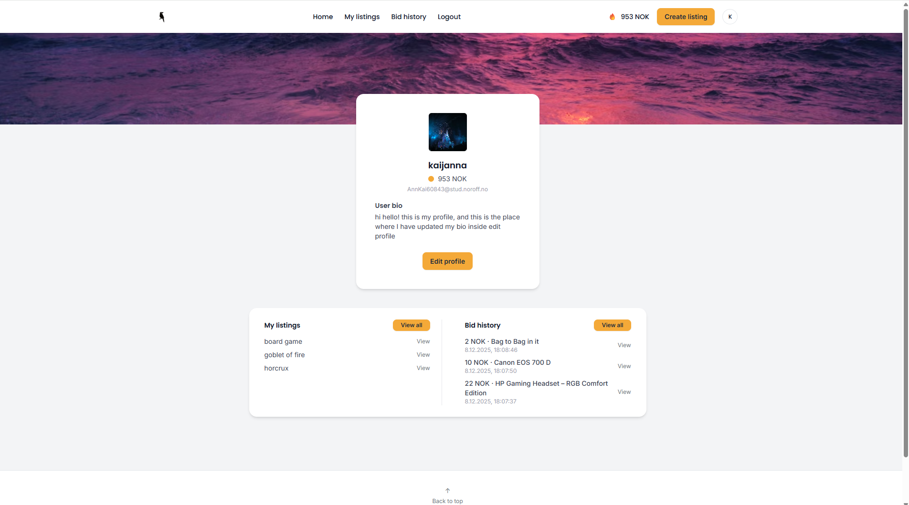
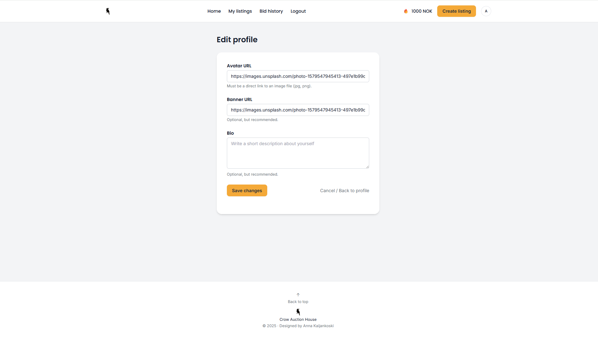

# Crow Auction House


Crow Auction House is an online auction platform where users can create listings, place bids, manage their profiles and compete for items in real time.

The project was developed as Semester Project 2 at Noroff and focuses on API integration, authentication, user-generated content and responsive frontend development.
[Live Site](https://semester-project-2-anna.netlify.app/)

## Improvements Made for Portfolio
Before adding this project to my portfolio, I reviewed the application and made improvements to the listing logic and user experience.
- Updated the "Ending Soon" filter to exclude expired auctions.
- Improved listing relevance by ensuring only active auctions appear in time-sensitive views.
- Reviewed homepage sorting logic and project documentation.
- Updated screenshots and README documentation.

These changes improve the accuracy of auction results and provide a more reliable user experience.

---

## Features

### User

- Register new account
- Log in / log out
- View profile
- Edit profile (bio, avatar, banner)
- See own credits

### Listings

- Browse all listings
- Search for listings
- View single listing
- Place bids
- Create listing
- Edit listing
- Delete listing
- View “My listings”
- View “My bids”

---

## Tech Stack

- **HTML5**
- **Tailwind CSS**
- **Vanilla JavaScript**
- **Noroff Auction API v2**

---

## How to Run the Project

1. Clone or download the repo
2. Install dependencies

```bash
npm install
```

3. Run development server

```bash
npm run dev
```

4. Open the project in your browser

```bash
http://localhost:5173
```

## Screenshots

### Home Page


### Single Listing



### Create Listing



### Profile Page



### Edit Profile



---

## Author

Anna – Frontend Development student at Noroff
